# Wazuh-SIEM-Homelab

## Project Overview
This project documents the deployment/configuration of a Wazuh SIEM system in a home lab environment. I chose Wazuh for this because it was a commonly used platform in many SOC environments and it also supports many different operating systems. The goal of this project was to gain hands on experience with security monitoring tools that would be used in real life SOC environments including the alert triage, file integrity monitoring, MITRE ATT&CK framework mapping, threat hunting, and compliance assessment. 
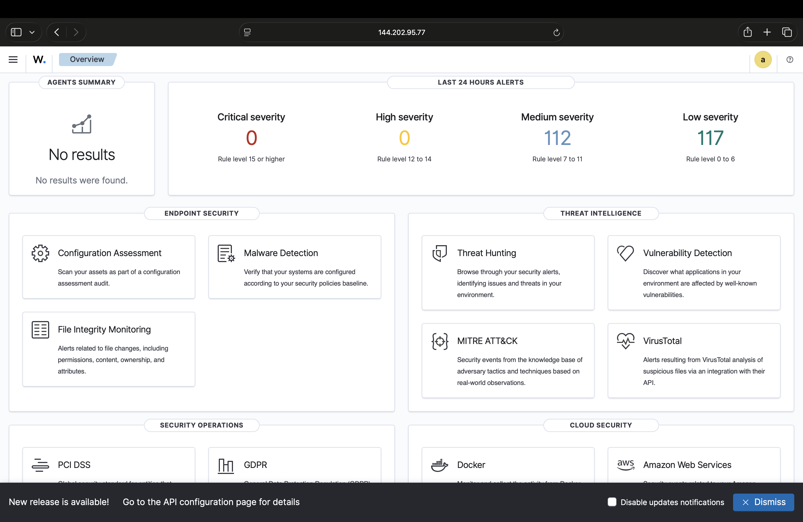

## Environment
- **SIEM Server**: VULTR Cloud VPS - Ubuntu 22.04 LTS x86_64, 4GB RAM, 2 vCPUs
- **Monitored Endpoint**: Apple Macbook Air M4 (macOS Sequoia) - Wazuh Agent 4.9.2
- **Wazuh Version**: 4.9.2 (all in one installation)
- **Components**: Wazuh Manager, Wazuh Indexer, Wazuh Dashboard, Filebeat

## Architecture
The lab uses a standard Wazuh single-node deployment:
- **Wazuh Manager** — receives and analyzes security events from agents, applies detection rules, and generates alerts
- **Wazuh Indexer** — stores alerts and events in an OpenSearch based database for search and analysis
- **Wazuh Dashboard** — visualizes the alert data, MITRE ATT&CK mappings, compliance status, and FIM results
- **Filebeat** — sends alert data from the Manager to the Indexer
- **Mac Agent (001)** — installed on the MacBook endpoint, monitors system activity and sends events to the Manager
The Wazuh server runs on a cloud VPS accessible with SSH. The Mac agent communicates with the manager over port 1514 (TCP).
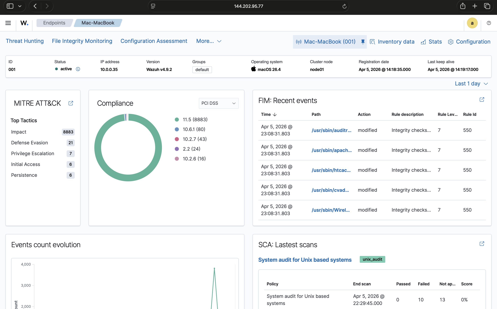
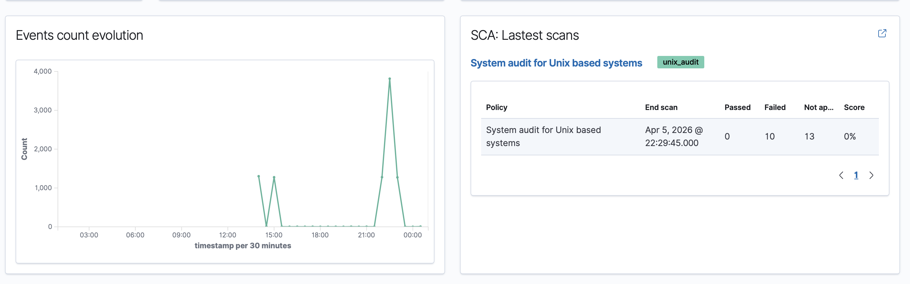

## Installation
This Wazuh server was deployed on a Vultr cloud VPS which was running Ubuntu 22.04 LTS x86_64. The official Wazuh all-in-one installation script was used to install and configure all components in a single command:

`curl -sO https://packages.wazuh.com/4.9/wazuh-install.sh && bash wazuh-install.sh -a`

This command automatically installed and started the Wazuh Manager, Indexer, Dashboard, and Filebeat. The dashboard was accessible at https://<server-ip> immediately after the installation process.

The Wazuh agent was installed on the MacBook endpoint and then enrolled to the server by using the agent enrollment command which was provided to me by the dashboard. The agent communicates with the manager over TCP port 1514.

## Findings and Analysis

### Alert Summary
In total there was 2,637 alerts that were generated and visible on the threat hunting dashboard within a 24 hour time period. These results showed that there were 0 level 12 or above alerts, 0 authentication failures, and a total of 8 authentication successes that came up from these scans. From a security perspective these results show that nobody attempted to make any sort of attacks to gain access to the system within that 24 hour time period as the alerts shown were all shown to be moderate to low level severity. This reveals a pretty healthy baseline security posture overall for a monitored endpoint since there were no attack patterns such as data exfiltration, lateral movement, or privilege escalation that happened either. If I were to see a spike in critical alerts during this time period then I would know that I should trigger an investigation into it. Upon the investigation I would be looking for details such as what time the alert(s) was triggered at and which agent triggered it.
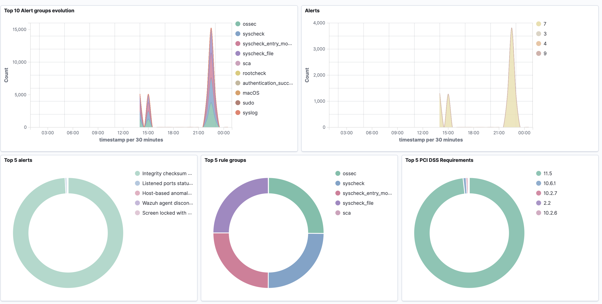
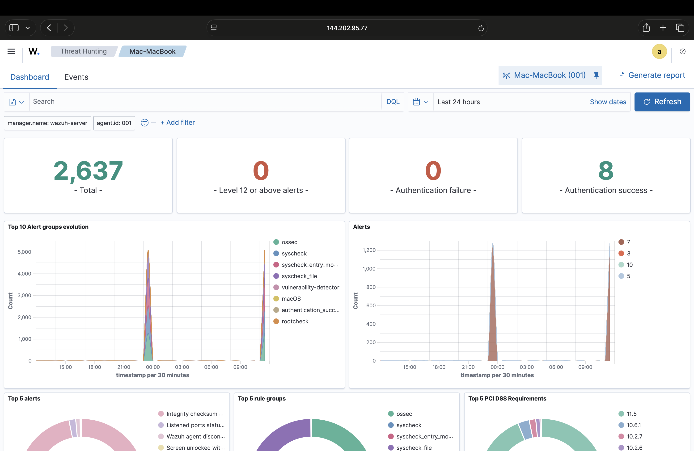
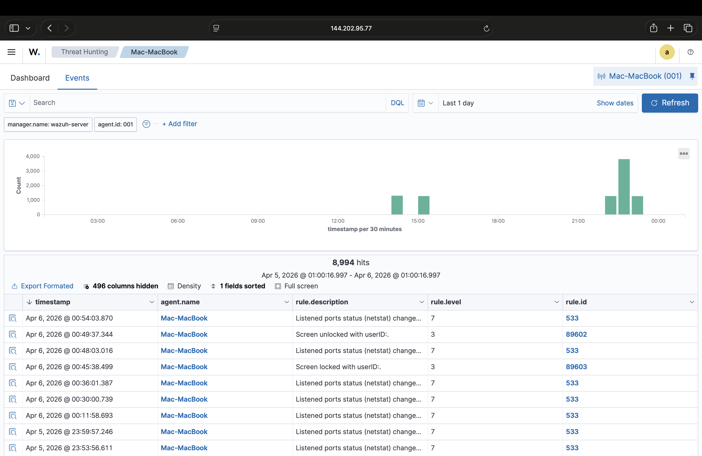

### Most Common Alert: Integrity Checksum Changed (Rule 550)
A checksum is a value assigned to a file based on a calculation made on the contents within it. Like a hash, if anything within it is changed then the value is changed which then triggers an alert. In Wazuh upon the installation the agent performs an initial baseline scan which then calculates the checksum of all the files and then proceeds to store said files within a database. With each scan that comes after it then checks the checksum of all those files again and compares them to their baselines, then if any of them result in any changes it fires off an alert. This alert specifically fired off so many times in my lab due to the fact that I am running it off of a macbook with MacOS Sequoia which makes constant small tweaks to system files. Every time Wazuh ran system scans it picked up on these changes and gave alerts on them (rule 550). In a real world environment I would need to be able to decipher actual suspicious changes such as a file having its actual contents modified versus ones that are completely normal such as slight value changes in files occurring after a system update.

### MITRE ATT&CK Mapping
"Stored Data Manipulation T1565.001" is when an attacker has changed data that has been stored within the system with the intention of covering their tracks, changing how a system normally operates, or to attack something directly. In my lab this is shown with the integrity checksum change alerts. It was mapped to the MITRE attack section because the detection itself doesn't differentiate from Apple just changing the system file itself versus it being modified by an attacker and MITRE mapping itself doesn't actually take into account the intent of the change.

The act of "Disabling or Modifying T1562" tools occurs when an attacker attempts to tamper with the security tools in place to reduce their chances of being detected such as removing firewalls, disabling antivirus setups, or changing your login settings. This likely was fired in my lab from the MacOS itself making changes to system files that were related to security and then Wazuh scanned and matched it to this pattern. In the case of a real attack, changing the security system files would be one of the first things they would do.

Attackers may also use "Valid Accounts T1078" to access a system instead of just trying to exploit vulnerabilities. They can do this with gaining access to real login credentials. This can be an extremely hard thing to detect because at the surface level it just looks like a normal user logging activity. This process was shown through my lab with the screen lock and unlock events. When my device locked and unlocked it was mapped as logged authentication activity. Normal login activity is logged as this technique because in a real world scenario, the same type of authentication event logs would come up with an attacker using stolen credentials.

"Linux/Mac File/Directory Permission Mods T1222.002" occurs when an attacker changes the permissions within a file to be able to gain access to them. This appeared within my project with terminal when the system blocked a command attempt to access developer tools, which was then flagged by Wazuh under the MITRE technique for permissions modifications. In the case of a real world attack scenario, the attacker might change the permissions on the file in order to gain access to sensitive information within it such as passwords, private certs, other login credential types, etc.
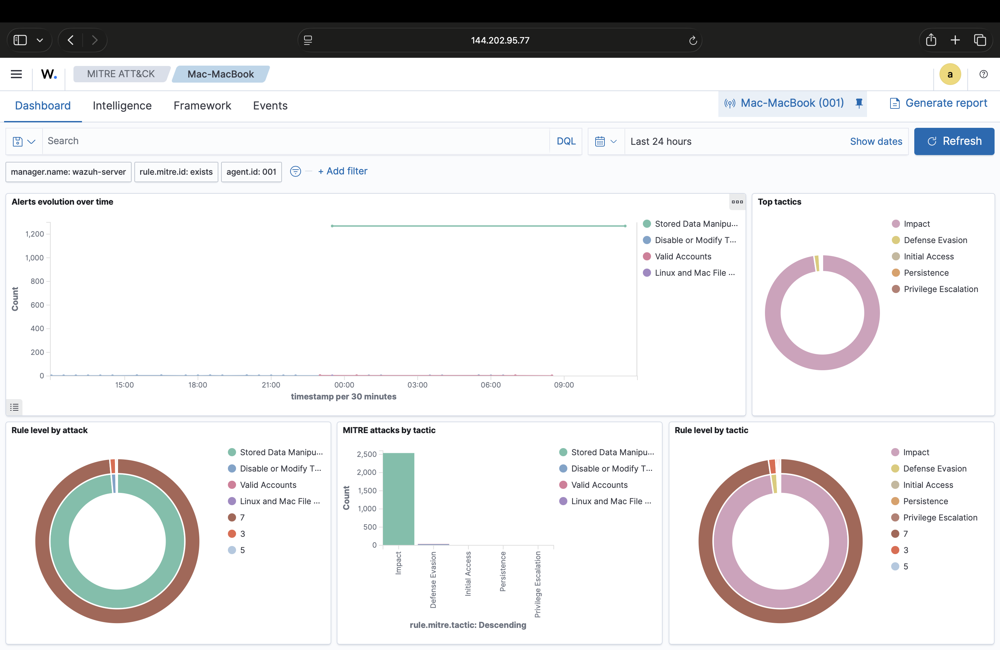
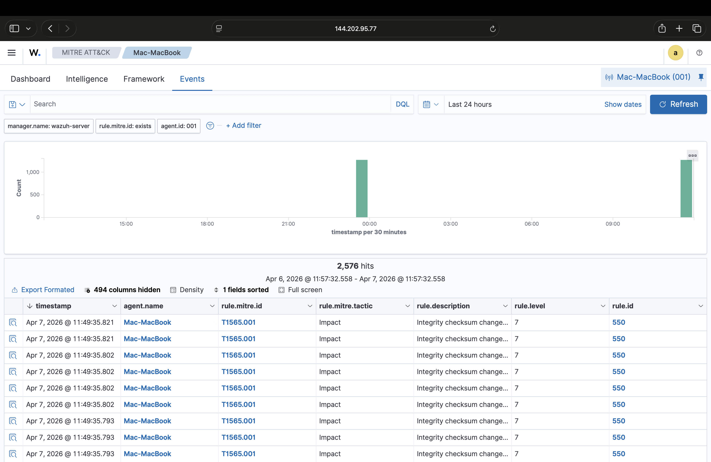

## File Integrity Monitoring (FIM)
FIM in Wazuh is handled by the syscheck module which comes preconfigured including default monitored directories depending on the OS that is being used which in my case was MacOS. The directories I used were /etc, /usr/bin, /usr/sbin, /bin and /sbin. Another thing I did as well was add /Users/<username>/Desktop in order to monitor the user directory. On the server side of it, the same server directories on the Ubuntu server are also monitored and the configuration for it is in the ossec.conf file on the agent. The rule 550 alert was generated thousands of times from the FIM module which is integrity checksum changes across the monitored mac system directories. These were mostly all from inode changes which macOS constantly updates during its system operations. The inventory tab under the FIM section also had a full list of all the monitored files with their baseline checksums, permissions, ownership info, and timestamps. MacOS does come with a FIM limitation that is worth noting. Wazuh supports only 2 types of FIM modes which are scheduled and real time scans. MacOS doesn't support inotify which is what the realtime mode uses from Linux to detect the file changes in real time when they happen. Mac uses a system called kqueue which Wazuh has not yet added. Because of this, Wazuh is only able to run the FIM in scheduled checks mode which means that it only scans periodically every 12 hours versus actually being able to scan them instantly as they happen so events such as file creation and deletion might not be recorded depending on when they happen. FIM is also a compliance requirement under frameworks like PCI DSS for an organization/company that is handling user data types like payment data, logins, sensitive identifying information, and health records.
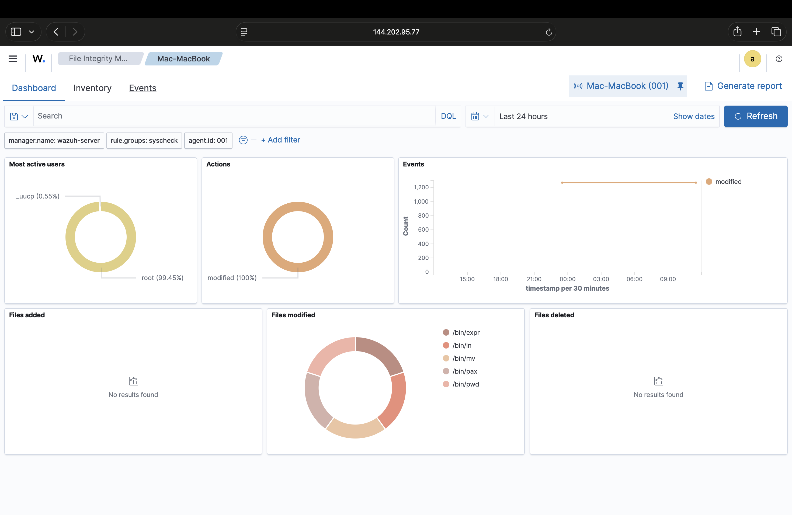
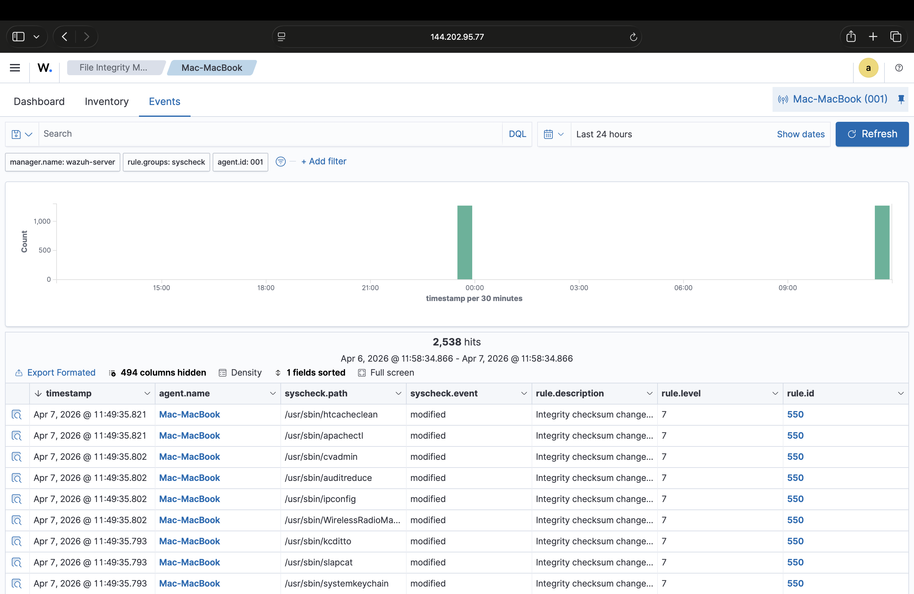

## Security Configuration Assessment (SCA) 
In my lab, the one that ran against my Mac agent was the system audit for Unix based systems. The results from my SCA showed a 0 percent score with 10 failed and 13 non applicable out of 23 total checks. The 0 percent was a result of none of the checks that were applicable passing. The not applicable checks that came up were ones that didn't apply to my specific system configurations. In real life, each check that is done would tell me exactly what's misconfigured and how I can go about fixing it. I would prioritize fixing the checks that came up as failed and then fix them in order to improve the score. A failed SCA would potentially mean that my system has a misconfiguration detected that could potentially lead to an attack. An example of this could be like if file sharing permissions were allowed when they shouldn't have been which is a potential open door straight to a network. Every failed check that happens is a gap in the security posture which is something an attacker could potentially exploit. 
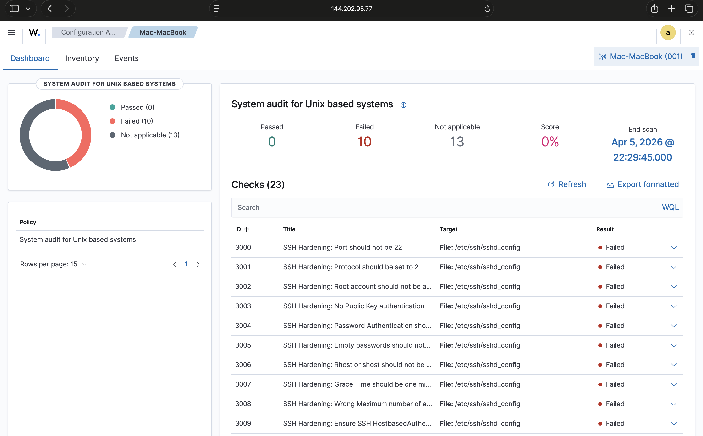
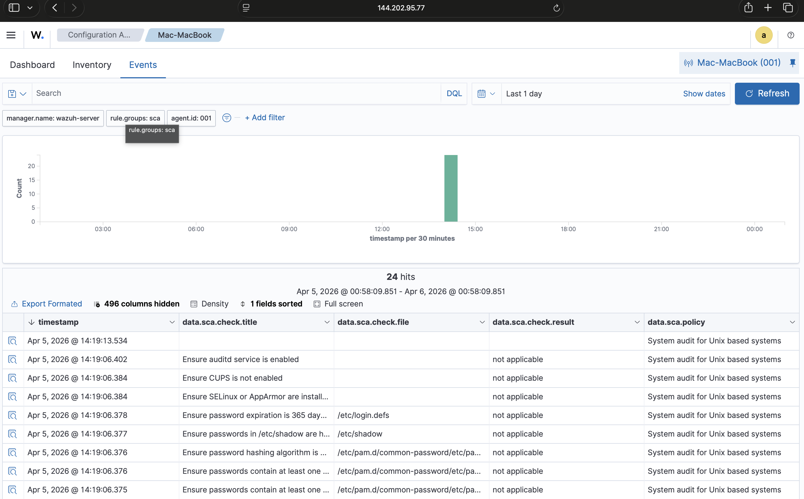

## Conclusion
I deployed a fully functional SIEM system on a cloud server and connected a real endpoint to it which I used to monitor, detect and analyze security events. I was also able to learn how a SIEM takes in data from the agents, how alerts are generated/categorized, and security events map the attack techniques to the MITRE ATT&CK framework as well as how the compliance frameworks such as PCI DSS use automated checks to measure the security posture. I also was able to learn about the limitations of certain operating systems, in my case macOS in relation to how they are able to be used with the security tools an example being how the FIM capabilities interact with macOS.

**Skills Demonstrated**
- SIEM deployment and configuration
- Endpoint agent enrollment
- Alert analysis: reading alerts, understanding rule levels, and differentiating between what alerts are suspicious versus which ones are normal
- MITRE ATT&CK framework knowledge: Being able to map the events to attack techniques
- File Integrity Monitoring: Learning how to understand checksums, baselines, and how changes within activity or files effect these.
- Security configuration assessment: Being able to understand what the compliance benchmarks are and what failed checks mean
- Cloud infrastructure: Being able to deploy and manage a Linux platform on a cloud platform
- SSH and command line proficiency as well as troubleshooting
**Next Steps**
If I were to expand upon this home lab and continue it the next step I would take would be to add more agents like a Windows VM with the goal of getting an even more diverse set of data. I would also explore adding things like custom detection rules in order to simulate more specific attack scenarios. I would also enable the vulnerability detection module to scan endpoints for known CVEs. Automating Wazuh to be able to block certain IPs as well when certain alert types fire could also be something I would explore. This project overall gave me great hands on experience with simulating a real workflow in a SOC environment.
